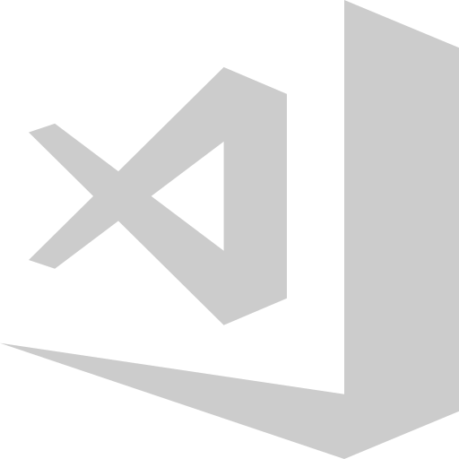

[![Stargazers][stars-shield]][stars-url]
[![Forks][forks-shield]][forks-url]
[![Issues][issues-shield]][issues-url]
[![MIT License][license-shield]][license-url]

<!-- PROJECT LOGO -->
<br />
<samp>
<p align="center">
  <a href="#">
    
  </a>

  <h3 align="center">VSCode Extensions</h3>

  <p align="center">
    My extensions used in Visual Studio Code.
    <br />
  </p>
</p>

<!-- TABLE OF CONTENTS -->
<details open="open">
  <summary>Table of Contents</summary>
  <ol>
      <ul>
        <li><a href="#extensions">Extensions</a>
          <ul>
            <li><a href="#appearance">Appearance</a></li>
            <li><a href="#utilities">Utilities</a></li>
            <li><a href="#installation">Installation</a></li>
          </ul>
        </li>
      </ul>
  </ol>
</details>

## Extensions

Below are listed by topic and in alphabetical order my IDE customization extensions and productivity and utility extensions.

### Appearance

[Glasslt-VSC](https://marketplace.visualstudio.com/items?itemName=s-nlf-fh.glassit) 
VS Code Extension to set window to transparent on Windows and Linux platforms.

[Material Icon Theme](https://marketplace.visualstudio.com/items?itemName=PKief.material-icon-theme)
Material Design Icons for Visual Studio Code

[Material Product Icons](https://marketplace.visualstudio.com/items?itemName=PKief.material-product-icons)
Product Icon Theme with Material Icons for VS Code

[Tokyo Night (Tokyo Night Storm)](https://marketplace.visualstudio.com/items?itemName=enkia.tokyo-night)
A clean Visual Studio Code theme that celebrates the lights of Downtown Tokyo at night.

<hr>

### Utilities

[Astro](https://marketplace.visualstudio.com/items?itemName=astro-build.astro-vscode)
Language support for Astro

[Better Align](https://marketplace.visualstudio.com/items?itemName=Chouzz.vscode-better-align)
Better vertical alignment with/without selection in any language for any characters or words.

[Better Comments](https://marketplace.visualstudio.com/items?itemName=aaron-bond.better-comments)
Improve your code commenting by annotating with alert, informational, TODOs, and more!

[Code Spell Checker](https://marketplace.visualstudio.com/items?itemName=streetsidesoftware.code-spell-checker)
Spelling checker for source code

[Color Highlight](https://marketplace.visualstudio.com/items?itemName=naumovs.color-highlight)
Highlight web colors in your editor

[Console Ninja](https://marketplace.visualstudio.com/items?itemName=WallabyJs.console-ninja)
JavaScript console.log output and runtime errors right next to your code.

[ES7+ React/Redux/React-Native snippets](https://marketplace.visualstudio.com/items?itemName=dsznajder.es7-react-js-snippets)
Extensions for React, React-Native and Redux in JS/TS with ES7+ syntax. Customizable. Built-in integration with prettier.

[ESLint](https://marketplace.visualstudio.com/items?itemName=dbaeumer.vscode-eslint)
Integrates ESLint JavaScript into VS Code.

[GistPad](https://marketplace.visualstudio.com/items?itemName=vsls-contrib.gistfs)
Manage your code snippets and developer notes using GitHub Gists and repositories.

[GitHub Copilot](https://marketplace.visualstudio.com/items?itemName=GitHub.copilot)
Your AI pair programmer

[GitLens — Git supercharged](https://marketplace.visualstudio.com/items?itemName=eamodio.gitlens)
Supercharge Git within VS Code — Visualize code authorship at a glance via Git blame annotations and CodeLens, seamlessly navigate and explore Git repositories, gain valuable insights via rich visualizations and powerful comparison commands, and so much more

[Inline Fold](https://marketplace.visualstudio.com/items?itemName=moalamri.inline-fold)
A custom decorator that "fold" matching content in single line

[IntelliSense for CSS class names in HTML](https://marketplace.visualstudio.com/items?itemName=Zignd.html-css-class-completion)
CSS class name completion for the HTML class attribute based on the definitions found in your workspace.

[JavaScript (ES6) code snippets](https://marketplace.visualstudio.com/items?itemName=xabikos.JavaScriptSnippets)
Code snippets for JavaScript in ES6 syntax

[JS JSX Snippets](https://marketplace.visualstudio.com/items?itemName=skyran.js-jsx-snippets)
Extensions for React, Redux in JS with babel and ES7 syntax

[Live Sass Compiler](https://marketplace.visualstudio.com/items?itemName=glenn2223.live-sass)
Compile Sass or Scss to CSS at realtime.

[Live Server](https://marketplace.visualstudio.com/items?itemName=ritwickdey.LiveServer)
Launch a development local Server with live reload feature for static & dynamic pages

[Markdown Preview Enhanced](https://marketplace.visualstudio.com/items?itemName=shd101wyy.markdown-preview-enhanced)
Markdown Preview Enhanced ported to vscode

[Nextjs snippets](https://marketplace.visualstudio.com/items?itemName=PulkitGangwar.nextjs-snippets)
snippets for nextjs

[Path Intellisense](https://marketplace.visualstudio.com/items?itemName=christian-kohler.path-intellisense)
Visual Studio Code plugin that autocompletes filenames

[PHP Intelephense](https://marketplace.visualstudio.com/items?itemName=bmewburn.vscode-intelephense-client)
PHP code intelligence for Visual Studio Code

[PHP IntelliSense](https://marketplace.visualstudio.com/items?itemName=zobo.php-intellisense)
Advanced Autocompletion and Refactoring support for PHP

[Portuguese - Code Spell Checker](https://marketplace.visualstudio.com/items?itemName=streetsidesoftware.code-spell-checker-portuguese)
Portuguese dictionary extension for VS Code.

[PostCSS Language Support](https://marketplace.visualstudio.com/items?itemName=csstools.postcss)
Syntax highlighting for modern and experimental CSS in VSCode

[Prettier - Code formatter](https://marketplace.visualstudio.com/items?itemName=esbenp.prettier-vscode)
Code formatter using prettier

[Prisma](https://marketplace.visualstudio.com/items?itemName=Prisma.prisma)
Adds syntax highlighting, formatting, auto-completion, jump-to-definition and linting for .prisma files.

[REST Client](https://marketplace.visualstudio.com/items?itemName=humao.rest-client)
REST Client for Visual Studio Code

[Sass](https://marketplace.visualstudio.com/items?itemName=Syler.sass-indented)
Indented Sass syntax Highlighting, Autocomplete & Formatter

[Svg Preview](https://marketplace.visualstudio.com/items?itemName=SimonSiefke.svg-preview)
Preview for Svg files

[Tailwind CSS IntelliSense](https://marketplace.visualstudio.com/items?itemName=bradlc.vscode-tailwindcss)
Intelligent Tailwind CSS tooling for VS Code

[WakaTime](https://marketplace.visualstudio.com/items?itemName=WakaTime.vscode-wakatime)
Metrics, insights, and time tracking automatically generated from your programming activity.


[contributors-shield]: https://img.shields.io/github/contributors/SilasRodrigues19/dotfiles.svg?style=for-the-badge
[contributors-url]: https://github.com/SilasRodrigues19/dotfiles/graphs/contributors
[forks-shield]: https://img.shields.io/github/forks/SilasRodrigues19/dotfiles.svg?style=for-the-badge
[forks-url]: https://github.com/SilasRodrigues19/dotfiles/network/members
[stars-shield]: https://img.shields.io/github/stars/SilasRodrigues19/dotfiles.svg?style=for-the-badge
[stars-url]: https://github.com/SilasRodrigues19/dotfiles/stargazers
[issues-shield]: https://img.shields.io/github/issues/SilasRodrigues19/dotfiles.svg?style=for-the-badge
[issues-url]: https://github.com/SilasRodrigues19/dotfiles/issues
[license-shield]: https://img.shields.io/github/license/SilasRodrigues19/dotfiles.svg?style=for-the-badge
[license-url]: https://github.com/SilasRodrigues19/dotfiles/blob/master/LICENSE
[license-url]: https://github.com/SilasRodrigues19/dotfiles/blob/master/LICENSE.txt


<hr>

### Installation

If you are interested in all the extensions listed above and you are a `Windows` user, you can run the `install_extensions.ps1` script located at 

[scripts/install_extensions.ps1](../scripts/install_extensions.ps1)

```bash
.\scripts\install_extensions.ps1
```

The script is adapted to the folder structure of this repository at an example level, you can modify the path of the `README.md` file that contains the extensions, in this code shown below which is located in the script file

```ps1
...
$fileName = "README"
$folderName = ".vscode"
$fileExtension = ".md"
$filePath = ".\$folderName\$fileName$fileExtension"
...
```


<br><hr>
[🔼 Back to top](#VSCode-Extensions)
